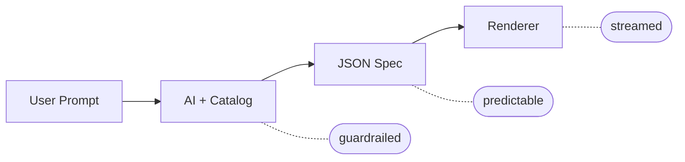

# json-render

**Predictable. Guardrailed. Fast.**

Let end users generate dashboards, widgets, apps, and videos from prompts — safely constrained to components you define.

```bash
npm install @json-render/core @json-render/react
# or for video
npm install @json-render/core @json-render/remotion
```

## Why json-render?

When users prompt for UI, you need guarantees. json-render gives AI a **constrained vocabulary** so output is always predictable:

- **Guardrailed** — AI can only use components in your catalog
- **Predictable** — JSON output matches your schema, every time
- **Fast** — Stream and render progressively as the model responds

## Quick Start

### 1. Define Your Catalog

```typescript
import { defineCatalog } from "@json-render/core";
import { schema } from "@json-render/react";
import { z } from "zod";

const catalog = defineCatalog(schema, {
  components: {
    Card: {
      props: z.object({ title: z.string() }),
      description: "A card container",
    },
    Metric: {
      props: z.object({
        label: z.string(),
        value: z.string(),
        format: z.enum(["currency", "percent", "number"]).nullable(),
      }),
      description: "Display a metric value",
    },
    Button: {
      props: z.object({
        label: z.string(),
        action: z.string(),
      }),
      description: "Clickable button",
    },
  },
  actions: {
    export_report: { description: "Export dashboard to PDF" },
    refresh_data: { description: "Refresh all metrics" },
  },
});
```

### 2. Define Your Components

```tsx
import { defineRegistry, Renderer } from "@json-render/react";

const { registry } = defineRegistry(catalog, {
  components: {
    Card: ({ props, children }) => (
      <div className="card">
        <h3>{props.title}</h3>
        {children}
      </div>
    ),
    Metric: ({ props }) => (
      <div className="metric">
        <span>{props.label}</span>
        <span>{format(props.value, props.format)}</span>
      </div>
    ),
    Button: ({ props, onAction }) => (
      <button onClick={() => onAction?.({ name: props.action })}>
        {props.label}
      </button>
    ),
  },
});
```

### 3. Render AI-Generated Specs

```tsx
function Dashboard({ spec }) {
  return <Renderer spec={spec} registry={registry} />;
}
```

**That's it.** AI generates JSON, you render it safely.

---

## Packages

| Package | Description |
|---------|-------------|
| `@json-render/core` | Schemas, catalogs, AI prompts, dynamic props, SpecStream utilities |
| `@json-render/react` | React renderer, contexts, hooks |
| `@json-render/react-native` | React Native renderer with standard mobile components |
| `@json-render/remotion` | Remotion video renderer, timeline schema |

## Renderers

### React (UI)

```tsx
import { defineRegistry, Renderer } from "@json-render/react";
import { schema } from "@json-render/react";

// Element tree spec format
const spec = {
  root: {
    type: "Card",
    props: { title: "Hello" },
    children: [
      { type: "Button", props: { label: "Click me" } }
    ]
  }
};

// defineRegistry creates a type-safe component registry
const { registry } = defineRegistry(catalog, { components });
<Renderer spec={spec} registry={registry} />
```

### Remotion (Video)

```tsx
import { Player } from "@remotion/player";
import { Renderer, schema, standardComponentDefinitions } from "@json-render/remotion";

// Timeline spec format
const spec = {
  composition: { id: "video", fps: 30, width: 1920, height: 1080, durationInFrames: 300 },
  tracks: [{ id: "main", name: "Main", type: "video", enabled: true }],
  clips: [
    { id: "clip-1", trackId: "main", component: "TitleCard", props: { title: "Hello" }, from: 0, durationInFrames: 90 }
  ],
  audio: { tracks: [] }
};

<Player
  component={Renderer}
  inputProps={{ spec }}
  durationInFrames={spec.composition.durationInFrames}
  fps={spec.composition.fps}
  compositionWidth={spec.composition.width}
  compositionHeight={spec.composition.height}
/>
```

## Features

### Streaming (SpecStream)

Stream AI responses progressively:

```typescript
import { createSpecStreamCompiler } from "@json-render/core";

const compiler = createSpecStreamCompiler<MySpec>();

// Process chunks as they arrive
const { result, newPatches } = compiler.push(chunk);
setSpec(result); // Update UI with partial result

// Get final result
const finalSpec = compiler.getResult();
```

### AI Prompt Generation

Generate system prompts from your catalog:

```typescript
const systemPrompt = catalog.prompt();
// Includes component descriptions, props schemas, available actions
```

### Conditional Visibility

```json
{
  "type": "Alert",
  "props": { "message": "Error occurred" },
  "visible": {
    "and": [
      { "path": "/form/hasError" },
      { "not": { "path": "/form/errorDismissed" } }
    ]
  }
}
```

### Dynamic Props

Any prop value can be data-driven using expressions:

```json
{
  "type": "Icon",
  "props": {
    "name": { "$cond": { "eq": [{ "path": "/activeTab" }, "home"] }, "$then": "home", "$else": "home-outline" },
    "color": { "$cond": { "eq": [{ "path": "/activeTab" }, "home"] }, "$then": "#007AFF", "$else": "#8E8E93" }
  }
}
```

Two expression forms:

- **`{ "$path": "/state/key" }`** -- reads a value from the data model
- **`{ "$cond": <condition>, "$then": <value>, "$else": <value> }`** -- evaluates a condition (same syntax as visibility conditions) and picks a branch

### Actions

Components can trigger actions, including the built-in `setState` action:

```json
{
  "type": "Pressable",
  "props": { "action": "setState", "actionParams": { "path": "/activeTab", "value": "home" } },
  "children": ["home-icon"]
}
```

The `setState` action updates the data model directly, which re-evaluates visibility conditions and dynamic prop expressions.

---

## Demo

```bash
git clone https://github.com/vercel-labs/json-render
cd json-render
pnpm install
pnpm dev
```

- http://localhost:3000 — Docs & Playground
- http://localhost:3001 — Example Dashboard
- http://localhost:3002 — Remotion Video Example

## How It Works



1. **Define the guardrails** — what components, actions, and data bindings AI can use
2. **Users prompt** — end users describe what they want in natural language
3. **AI generates JSON** — output is always predictable, constrained to your catalog
4. **Render fast** — stream and render progressively as the model responds

## License

Apache-2.0
